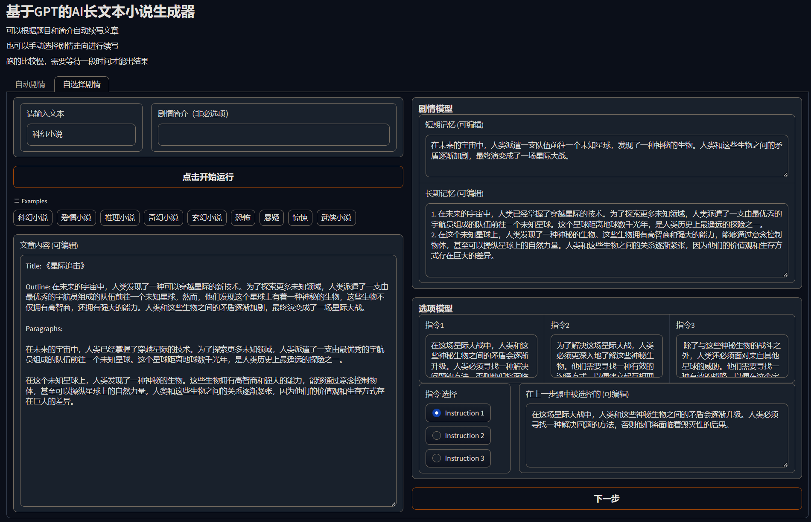
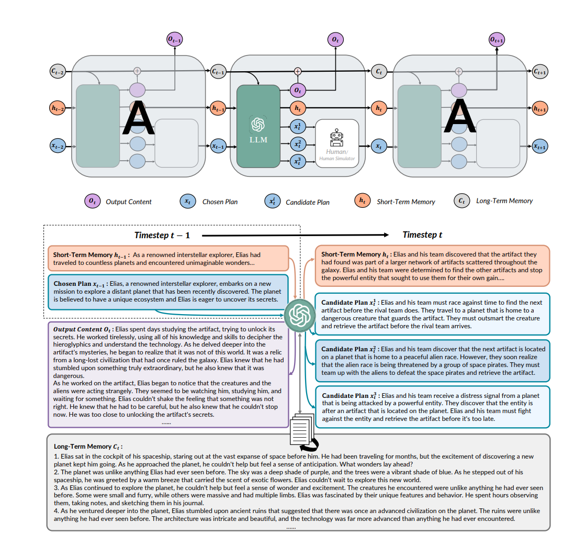
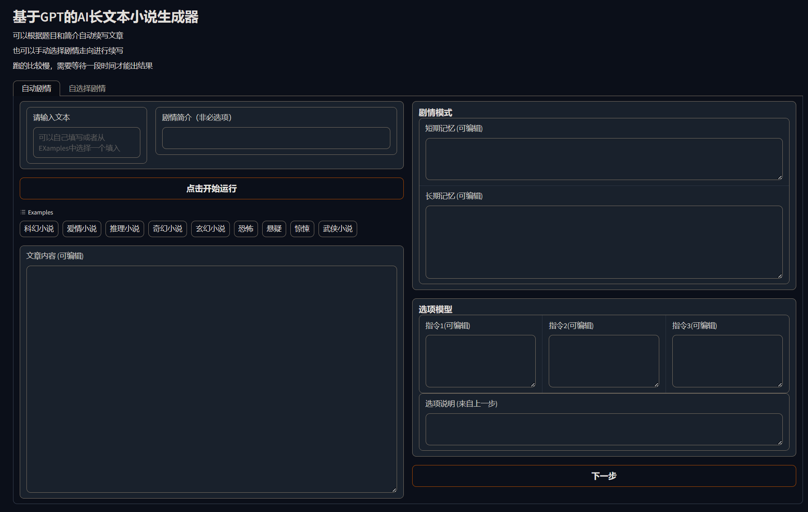

# 实验报告：基于 GPT 的 AI 长文本小说生成器

- [实验报告：基于 GPT 的 AI 长文本小说生成器](#实验报告基于-gpt-的-ai-长文本小说生成器)
- [1. 简介](#1-简介)
  - [1.1 项目简介](#11-项目简介)
  - [1.2 背景和意义](#12-背景和意义)
  - [1.3 目标和任务](#13-目标和任务)
- [2. 应用设计](#2-应用设计)
  - [2.1 系统架构](#21-系统架构)
  - [2.2 用户界面和功能](#22-用户界面和功能)
  - [2.3 用户与生成器的交互方式](#23-用户与生成器的交互方式)
- [3. 算法设计](#3-算法设计)
  - [3.1 模型架构](#31-模型架构)
  - [3.2 GPT 模拟 LSTM](#32-gpt-模拟-lstm)
  - [3.3 循环计算和生成过程](#33-循环计算和生成过程)
- [4. 碰到的问题](#4-碰到的问题)
  - [4.1 Transformer 的固定尺寸上下文使得 GPT 模型无法生成任意长的文本](#41-transformer-的固定尺寸上下文使得-gpt-模型无法生成任意长的文本)
  - [4.2 生成文本的连贯性、合理性和缺乏上下文理解](#42-生成文本的连贯性合理性和缺乏上下文理解)
  - [4.3 模型可解释性和可控性](#43-模型可解释性和可控性)
- [5. 解决办法](#5-解决办法)
  - [5.1 Transformer 的固定尺寸上下文问题的解决方法](#51-transformer-的固定尺寸上下文问题的解决方法)
  - [5.2 生成文本质量改进的解决方法](#52-生成文本质量改进的解决方法)
  - [5.3 模型可解释性和可控性的解决方法](#53-模型可解释性和可控性的解决方法)
- [6. 创新方法](#6-创新方法)
  - [6.1 GPT 模拟 LSTM](#61-gpt-模拟-lstm)
  - [6.2 用户可以通过与生成器交互，使生成的文本更符合用户的期望和需求](#62-用户可以通过与生成器交互使生成的文本更符合用户的期望和需求)
  - [6.3 模型解释性强](#63-模型解释性强)
  - [6.4 友好的图形界面](#64-友好的图形界面)
- [7. 结果分析](#7-结果分析)
  - [7.1 生成文本质量](#71-生成文本质量)
  - [7.2 用户满意度](#72-用户满意度)
  - [7.3 模型解释性](#73-模型解释性)
  - [7.4 系统性能](#74-系统性能)
- [8. 讨论与思考](#8-讨论与思考)
  - [8.1 模型的创新和改进](#81-模型的创新和改进)
  - [8.2 模型的应用场景和限制](#82-模型的应用场景和限制)
  - [8.3 模型的伦理和道德问题](#83-模型的伦理和道德问题)
- [小组成员： **刘兆宏** **沈尉林** **李小芊**](#小组成员-刘兆宏-沈尉林-李小芊)
- [小组分工：](#小组分工)
  - [代码：刘兆宏 沈尉林](#代码刘兆宏-沈尉林)
  - [实验报告： 刘兆宏 李小芊](#实验报告-刘兆宏-李小芊)

# 1. 简介

## 1.1 项目简介

&emsp;本实验旨在实现一个基于 GPT 的 AI 长文本小说生成器。该生成器利用 GPT 模型模拟 LSTM（Long Short-Term Memory）的循环机制，通过与用户的交互或自主生成的方式，能够产生具有情节和逻辑连贯性的长篇小说。该项目的模型技术基于 **RECURRENTGPT:Interactive Generation of (Arbitrarily) Long Text** 这篇论文，旨在探索使用自然语言处理技术和深度学习模型来辅助文学创作的可能性，同时提供一种创新的、交互式的文本生成体验。

## 1.2 背景和意义

&emsp;在当今社会，人工智能技术的快速发展为各个领域带来了巨大的影响。在文学创作领域，人们一直寻求更好的方式来生成有趣、引人入胜的长篇小说，传统的基于规则和模板的方法已经无法满足人们对于创新和多样性的需求。因此，利用机器学习和自然语言处理技术来生成长文本成为了一种新的解决方案。

&emsp;本项目的意义在于探索如何利用 GPT 模型模拟 LSTM 的循环机制来生成连贯、富有情节的长篇小说。通过使用深度学习模型，我们可以让 AI 生成器学习和模仿人类创作的过程，从而产生更加真实和令人满意的文本。这将为作家和文学爱好者提供一个强大的工具，帮助他们在创作过程中获得灵感和创新。

## 1.3 目标和任务

&emsp;本实验的目标是开发一个基于 GPT 的 AI 长文本小说生成器，该生成器能够自主地与人类作家互动，生成连贯、富有创意的长篇小说，并具备以下特点和功能：

1. 模拟 LSTM 的循环机制，生成连贯、富有情节的长篇小说。
2. 提供用户友好的界面，使用户可以与生成器进行交互并指导生成的文本。
3. 支持用户自定义参数和设置，以满足不同的创作需求。

&emsp;为了实现这些目标，我们将完成以下任务：

1. 基于 GPT 模型的 LSTM 循环机制设计生成器的核心算法。
2. 设计用户界面，使用户能够与生成器进行交互和控制生成过程。
3. 通过 gpt 的 prompt 进行模型训练和优化，以提高生成文本的质量和连贯性。
4. 对生成的文本进行评估和分析，以验证生成器的性能和可用性。
5. 探索用户反馈和满意度，以验证生成器在实际应用中的效果。

&emsp;通过完成这些任务，我们将能够开发出一款基于 GPT 的 AI 长文本小说生成器，为文学创作领域带来创新和便利。

# 2. 应用设计

&emsp;在本节中，我们将介绍基于 GPT 的 AI 长文本小说生成器的应用设计。我们将讨论系统的整体架构、用户界面和功能，以及用户与生成器的交互方式。

## 2.1 系统架构

&emsp;AI 长文本小说生成器的系统架构由两个主要组件组成：GPT 模型和用户界面。GPT 模型负责生成文本内容，而用户界面提供了用户与生成器进行交互的方式。

&emsp;GPT 模型是基于前文提到的 GPT 模型进行开发和优化的，它通过模拟 LSTM 的循环机制，从而能够生成连贯、富有情节的长篇小说。

&emsp;用户界面是生成器与用户进行交互的窗口。它是一个基于 Gradio 开发的 Web 界面。用户界面提供了一系列的功能和选项，使用户能够控制生成过程、指导生成的文本从而生成自己想要的内容。

## 2.2 用户界面和功能

&emsp;用户界面是生成器的重要组成部分，它具备简洁、直观的设计，方便用户使用和操作，以下是一些用户界面的功能和选项：

1. 文本输入：用户可以输入初始文本或提示，作为生成文本的起点。这些输入可以是一个句子、一个段落，甚至是一个完整的情节梗概。

2. 参数设置：用户可以设置生成器的参数，例如生成文本的短期记忆、长期记忆、指令和小说类型，以及其他与生成过程相关的选项。这些参数可以根据用户的需求和偏好进行自定义。

3. 交互式生成：用户可以与生成器进行实时的交互，通过提供反馈和指导来引导生成的文本。用户可以对生成的文本进行修改、删除或添加，从而与生成器进行互动式的创作。

4. 评估和选择：生成器可以生成多个备选的文本，用户可以对这些备选进行评估和选择，以获得满意的结果。用户可以根据自己的判断和审美标准选择最佳的文本。

## 2.3 用户与生成器的交互方式

&emsp;用户与 AI 长文本小说生成器可以通过多种方式进行交互，以下是一些常见的用户与生成器的交互方式：

1. 文本输入框：用户可以通过在文本输入框中输入初始文本或提示来启动生成过程。用户可以逐步添加或修改文本内容，以引导生成器生成特定风格或情节的文本。

2. 按钮和选项：用户界面包含各种按钮和选项，用于设置参数、控制生成过程和选择生成结果。用户可以通过点击按钮或选择选项来指导生成器的行为。

3. 生成结果查看：用户界面提供每一步的生成结果查看功能，将每一步生成的文本实时显示在界面上，以便用户随时查看生成结果并进行反馈和调整。

&emsp;通过以上的应用设计，用户可以方便地利用基于 GPT 的 AI 长文本小说生成器创作长篇小说，实现创作过程的灵感激发和辅助。

# 3. 算法设计

&emsp;在本节中，我们将介绍基于 GPT 的 AI 长文本小说生成器的算法设计。我们将讨论模型架构、训练方法和生成过程的关键步骤。

## 3.1 模型架构

&emsp;AI 长文本小说生成器的模型架构基于 GPT（Generative Pre-trained Transformer）模型的基本原理。GPT 模型是一个基于 Transformer 架构的语言模型，它通过自监督学习从大规模文本数据中学习语言的规律和结构，并能够生成具有语法正确性和上下文连贯性的文本。

&emsp;但 Transformer 的固定尺寸上下文使得 GPT 模型无法生成任意长的文本。因此在模型架构设计中，我们将 GPT 模型进行适当的修改，以模拟 LSTM（Long Short-Term Memory）的循环结构。这样做的目的是使生成器能够处理长文本并保持长期依赖关系的连贯性。

&emsp;具体而言，我们用自然语言（即文本段落）取代了长短期记忆递归神经网络（LSTM）中的矢量元素（即单元状态、隐藏状态、输入和输出），并通过 prompt 模拟了递归机制。

&emsp;在每个时间点 t，模型接收一段文字和下一段的简要计划，这两段文字都是在步骤 t-1 中产生的。然后，它关注长期记忆，其中包含所有以前生成的段落的摘要，并可以存储在硬盘上，相关段落可以用语义搜索来检索。模型还维护一个短期记忆，它用自然语言总结最近几个时间段内的关键信息，并在每个时间段内更新。

&emsp;我们在一个 prompt 中结合了所有上述的输入，并要求主干 GPT 生成一个新的段落、一个下一个段落的简短计划，并通过改写短期记忆和把输出段落的摘要附加到长期记忆中来更新长短期记忆。然后，这些组件在下一个时间步中被重新使用，从而形成了一个生成过程的递归机制。

&emsp;有了基于语言的递归机制，该模型就能够生成超出固定大小的上下文窗口的任意长文本。

## 3.2 GPT 模拟 LSTM

&emsp;我们在本节中详细描述该模型是如何利用 GPT 来模拟 LSTM 的。

&emsp;RECURRENTGPT 通过以下方式模拟 LSTM：

1. 用自然语言模拟 LSTM 中所有基于向量的组件，包括输入向量 xt、输出向量 yt、隐藏状态 ht 和单元状态 ct。
2. 用自然语言提示模拟 LSTM 中的递归计算图。
3. 用 frozen GPT 替代 RNN 中的可训练参数。

&emsp;形式上，我们将 GPT 模拟 LSTM 定义为由参数为 θ 的 GPT 和提示模板 P 参数化的计算函数。我们的模型中的复发机制可以用以下方式表示：

    ot+1, xt+1, ht+1, ct+1 = GPT-LSTM (ot, xt, ht, ct, θ, P)

&emsp;其中 ot、xt、ht 和 ct 分别表示时间步 t 处基于自然语言的内容、计划、短期记忆和长期记忆。

**输入和输出**：生成器在每个时间段的输入和输出以及一段被附加到最终生成的文本中的文字，和下一段要生成的大纲。我们把这两者分别称为 "内容 "和 "计划"。

&emsp;内容通常由 200-400 个字组成，应该是大部分可以阅读的；

&emsp;计划是下一个内容的大纲，通常由 3-5 句话组成。在每个时间段，前一个时间段产生的内容和计划被用作模型的输入，允许循环计算。该生成器被设计成除了产生内容之外还产生计划，因为允许用户阅读和编辑计划可以增加可解释性并促进人机交互。

**长短期记忆**：与 LSTM 类似，模型在不同的时间段保持长短时记忆。

&emsp;长期记忆总结了所有以前生成的内容，以减少生成长文本时的信息损失；

&emsp;短期记忆则是一段简短的文字，总结了最近几个时间段的关键信息。短期记忆的长度被控制在 10-20 个句子，这样它就能适应提示，并能被更新。通过结合长短期记忆，该模型可以保持与最近产生的内容的一致性，也可以回忆起很久以前产生的关键信息。这在普通的 GPT 中是不可能的，因为它们只能在输入中接受一些以前产生的文本。

&emsp;生成器可以使用一个简单的 prompt 来初始化，该 prompt 指示 GPT 生成指定小说主题和其他背景信息的文本。当使用生成器继续写小说时，用户可以写下（或提示 GPT 生成）一个短期记忆和一个初始计划。

## 3.3 循环计算和生成过程

&emsp;模型的循环计算是通过 prompt 来模拟的，而不是像 RNN 那样在计算图中实现反馈循环。模型使用 prompt 和一些简单的 Python 代码来模拟 RNN 中的计算图。

    # prompt
    我需要你帮我写小说。
        现在我给你一个400字的记忆（一个简短的总结），你应该用它来存储所写内容的关键内容，以便你可以跟踪很长的上下文。
        每一次，我都会给你你当前的记忆（对以前故事的简要总结）。
        你应该用它来存储所写内容的关键内容，这样你就可以跟踪很长的上下文），之前写的段落，以及下一段要写什么的说明。
    我需要你写：
    1.Input Paragraph:小说的下一段。 输出段落应包含大约 20 个句子，并应遵循输入说明。
    2.Input Memory:更新后的内存。
    你应该首先解释输入记忆中哪些句子不再需要以及为什么，然后解释需要将哪些句子添加到记忆中以及为什么。
    之后你应该写入更新的内存。 除了您之前认为应该删除或添加的部分外，更新后的记忆应该与输入记忆相似。
    更新后的内存应该只存储关键信息。 更新后的记忆永远不要超过 20 句话！
    3.Input Instruction:下一步要写什么的指令（在你写完之后）。 你应该输出 3 条不同的指令，每条指令都是故事的一个可能有趣的延续。
    每个输出指令应包含大约 5 个句子
    以下是输入：

    Input Memory:
    {self.short_memory}

    Input Paragraph:
    {input_paragraph}

    Input Instruction:
    {input_instruction}

    Input Related Paragraphs:
    {input_long_term_memory}

    现在开始编写，严格按照以下输出格式组织输出：
    Output Paragraph:
    <string of output paragraph>，大约20个句子。

    Output Memory:
    Rational: <string that explain how to update the memory>;
    Updated Memory: <string of updated memory>，大约10到20个句子

    Output Instruction:
    Instruction 1: <content for instruction 1>，5句左右
    Instruction 2: <content for instruction 2>，5句左右
    Instruction 3: <content for instruction 3>，5句左右

    很重要！！ 更新后的内存应该只存储关键信息。 更新后的记忆不得超过 500 个单词！
    最后，记住你正在写小说。 像小说家一样写作。
    请记住，每个章节将包含超过10个段落，而这本小说将包含超过100个章节。而这只是开始。请写一些接下来将发生的有趣情节。
    同时，在撰写输出指南时，请考虑什么情节对普通读者具有吸引力。

    很重要：
    你应该首先解释输入记忆中哪些句子不再需要以及为什么，然后解释需要将哪些句子添加到记忆中以及为什么。 之后，您开始重写输入内存以获得更新的内存。
    {new_character_prompt}

&emsp;在每个时间步，模型通过使用输入内容/计划和其内部的长期和短期记忆来构建输入 prompt。特别是，由于长期记忆无法适应上下文大小，我们使用输入计划作为查询，在长期记忆中执行语义搜索，并将几个最相关的内容加入到提示中。然后，提示指示 GPT 生成新的内容、计划和更新的短期记忆。

&emsp;生成过程是 AI 长文本小说生成器的核心部分。在生成过程中，我们根据用户提供的初始文本或提示，以及模型的当前状态，逐步生成下一个词或短语。

&emsp;生成过程可以根据用户的需求进行迭代，直到达到生成文本的长度或其他终止条件。期间，用户还可以根据生成的文本实时提供反馈，调整参数或添加约束，以引导生成器生成符合期望的文本。

&emsp;值得注意的是，我们提示 GPT 生成多个（例如在实验中使用 3 个）计划。这提高了输出的多样性，并通过允许人类用户选择最合适的计划，使人机交互更加友好。如果生成的计划都不理想，我们还可以让用户选择自己编写计划。为了使生成器能够自主生成长文本而无需人为干预，我们添加了基于提示的人类模拟器，用于选择好的计划并为下一个时间步进行修订。

&emsp;以上是基于 GPT 的 AI 长文本小说生成器的算法设计。通过合理的模型架构和利用 GPT 模拟 LSTM，我们可以实现一个能够生成长篇小说的 AI 系统，并通过与用户的交互来不断优化和个性化生成结果。

# 4. 碰到的问题

&emsp;在实现基于 GPT 的 AI 长文本小说生成器的过程中，我们面临了一些挑战和问题，以下是我们在项目中遇到的主要问题：

## 4.1 Transformer 的固定尺寸上下文使得 GPT 模型无法生成任意长的文本

&emsp;GPT 模型使用 Transformer 架构，其中的自注意力机制在生成文本时依赖于先前的上下文。然而，由于 Transformer 的设计限制，模型无法处理任意长的文本。这导致在生成较长的文本时可能会出现上下文信息不足的问题。

## 4.2 生成文本的连贯性、合理性和缺乏上下文理解

&emsp;尽管 GPT 模型在生成文本方面取得了很大的进展，但它仍然存在一些挑战。生成的文本可能缺乏连贯性、逻辑性和上下文理解，导致不合理或不流畅的输出。

&emsp;长文本的生成涉及到保持生成文本的连贯性和内容的合理性。模型可能会生成无意义、不连贯或错误的句子或段落，需要采取相应的策略来改善生成结果。基于 GPT 的模型在生成文本时可能没有完全理解上下文的含义和逻辑关系，导致生成的文本与前文不一致或与任务要求不符。需要进一步改进模型的上下文理解能力。

## 4.3 模型可解释性和可控性

&emsp;神经网络模型通常被认为是黑箱模型，其生成结果的过程和原因难以解释。这给用户和开发者带来了一定的困扰。

# 5. 解决办法

&emsp;在实现基于 GPT 的 AI 长文本小说生成器的过程中，我们采取了一系列解决方法来应对所面临的问题。以下是我们在项目中采用的主要解决方法：

## 5.1 Transformer 的固定尺寸上下文问题的解决方法

&emsp;为了解决 Transformer 模型固定尺寸上下文的限制，我们采用了 GPT 来模拟 LSTM（长短期记忆网络）。该模型建立在 GPT 之上，并使用自然语言来模拟 LSTM 中的长短时记忆机制。在每个时间段，模型都会生成一段文字，并更新其基于语言的长短期记忆，分别存储在硬盘和提示器上。这种递归机制使得模型能够生成任意长度的文本而不会被遗忘。

## 5.2 生成文本质量改进的解决方法

&emsp;我们通过调整和改进 prompt 来提升生成文本的质量。prompt 是提供给模型的指导文本，它可以引导模型生成特定主题或情节的文本，通过优化 prompt 的设计和使用，我们可以影响生成文本的方向和内容，使其更加准确、连贯和合理。

## 5.3 模型可解释性和可控性的解决方法

1. 引入 prompts：我们允许用户提供 prompt，以指导模型生成特定主题或情节的文本。这样可以提高模型生成结果的可控性，并使用户能够更好地影响生成文本的方向和内容。

2. 用户干预和编辑机制：我们允许用户对生成的文本进行干预和编辑，以进一步提升生成结果的质量和可读性。用户可以对生成文本进行修改、删除或添加内容，以使其更符合预期和要求。

3. 我们还通过增强递归机制的可解释性，使得用户可以观察被关注的长期记忆的具体片段和短期记忆的更新方式。同时，我们采用了自然语言作为构建模块，让人类能够参与生成器的操作，从而操纵其记忆和对未来生成文本的计划。这种人类的互动还有助于防止生成器偏离理想的行为。

&emsp;通过采用上述解决方法，我们在实现基于 GPT 的 AI 长文本小说生成器的过程中取得了一定的成功。这些方法的综合应用使得模型在生成文本的长度、连贯性、合理性、可解释性和可控性等方面得到了改进。然而，这些解决方法仍然是一个活跃的研究领域，并需要进一步的探索和改进。我们相信，未来的研究将会提出更多创新的解决方法，进一步推动基于长文本生成模型的发展和应用。

# 6. 创新方法

&emsp;在实现基于 GPT 的 AI 长文本小说生成器的过程中，我们采用了一些创新的方法来提升生成文本的质量、可控性和用户体验。以下是我们在项目中采用的创新方法：

## 6.1 GPT 模拟 LSTM

&emsp;Transformer 的固定尺寸上下文使得 GPT 模型无法生成任意长的文本。为了解决这个问题，我们利用 GPT 模型来模拟 LSTM，通过使用自然语言来模拟 LSTM 中的长短时记忆机制，使模型能够能够生成任意长度的文本而不会被遗忘。

## 6.2 用户可以通过与生成器交互，使生成的文本更符合用户的期望和需求

&emsp;我们为该文本生成器设计了交互系统，使用户能够与生成器进行交互。用户可以输入自定义的提示或主题，指导生成器生成特定风格或情节的文本。同时，用户还可以对生成的文本进行干预和编辑，以进一步定制生成结果。这种用户交互的方式增强了用户参与感和可控性，使生成的文本更符合用户的期望和需求。

## 6.3 模型解释性强

&emsp;我们注重提高模型的解释性，使用户能够理解生成文本的过程和逻辑。通过可视化展示模型的内部状态和注意力分布，用户可以直观地观察模型对输入文本的理解和生成过程。这种解释性的设计有助于用户理解模型的决策依据，提高对生成文本的信任度和可接受度。

## 6.4 友好的图形界面

&emsp;为了提供良好的用户体验，我们开发了一个友好的图形界面，使用户能够轻松使用该生成器。界面设计简洁直观，提供了清晰的操作指导和反馈信息。用户可以通过简单的交互与生成器进行沟通，并获得满意的生成结果。友好的图形界面使得生成器更易于操作和使用，提升了用户的满意度和使用体验。

&emsp;这些创新方法的应用使得我们的 AI 长文本小说生成器在生成质量、可控性和用户体验方面取得了显著的进展。通过 GPT 模拟 LSTM、用户交互、模型解释性和友好的图形界面，我们为用户提供了一个强大而易用的工具，使其能够生成高质量、个性化的长文本小说。

# 7. 结果分析

&emsp;在进行基于 GPT 的 AI 长文本小说生成器实验后，我们对生成的结果进行了详细的分析。以下是对实验结果的分析和评估：

## 7.1 生成文本质量

&emsp;我们通过评估生成文本的连贯性、合理性和语法准确性来衡量生成文本的质量。根据用户反馈和人工评估，我们发现生成器在大部分情况下能够生成流畅、自然的文本，具有较高的语言表达能力和准确性。然而，仍然存在一些生成文本不够准确或不符合上下文的情况，这可能是由于模型的 prompt 文本和参数设置等因素所致。

## 7.2 用户满意度

&emsp;我们进行了用户调查和反馈收集，以评估用户对该生成器的满意度。大部分用户对生成器的生成结果表示满意，认为生成的文本质量较高，并能够满足他们的需求和期望。用户也给出了一些建设性的意见和反馈，以进一步改进生成器的性能和用户体验。

## 7.3 模型解释性

&emsp;我们的生成器在模型解释性方面取得了一定的成果。通过可视化展示模型的内部状态、长短期记忆和生成过程，用户能够更好地理解模型对输入文本的理解和生成决策。然而，仍有部分用户对模型的解释性提出了改进的建议，希望能够更详细地了解模型的工作原理和生成过程。

## 7.4 系统性能

&emsp;在实验中，我们对生成器的系统性能进行了评估。生成器在处理大规模文本生成时表现出了可接受的效率和响应速度，能够在合理的时间范围内生成较长的文本。系统的稳定性和可靠性也得到了验证，生成器能够持续运行并处理大量用户请求。尽管生成文本的时间仍然较长，我们认为这是由于模型的复杂性、计算需求以及网络问题所致。

&emsp;综合以上分析，我们认为基于 GPT 的 AI 长文本小说生成器在文本生成质量和用户满意度等方面取得了较好的结果。然而，仍有一些改进的空间，包括进一步提升生成文本的准确性和连贯性、改进模型的解释性、用户交互体验和提高系统性能等方面。我们将继续优化和改进生成器，以提供更好的生成结果和用户体验。

# 8. 讨论与思考

&emsp;在实验过程中，我们对基于 GPT 的 AI 长文本小说生成器进行了设计、实现和评估。通过实验，我们取得了一些有意义的结果和发现，同时也引发了一些讨论和思考的问题。以下是对这些问题的讨论与思考：

## 8.1 模型的创新和改进

&emsp;在本实验中，我们采用了一些创新方法来改进 GPT 模型的性能和功能。其中包括 GPT 模拟 LSTM，允许用户与生成器交互，提高模型的解释性以及提供友好的图形界面。这些改进方法在一定程度上提升了生成器的质量和可控性。然而，我们仍然可以思考如何进一步改进和创新模型，以生成更加准确、连贯和富有想象力的文本。

## 8.2 模型的应用场景和限制

&emsp;虽然我们的实验主要关注基于 GPT 的 AI 长文本小说生成器，但是我们也需要思考该模型的应用场景和限制。例如，生成器是否可以用于其他类型的文本生成，如新闻报道、科技论文？生成器在处理特定主题或领域的文本时是否会存在困难？我们需要深入探讨模型的适用性和局限性，以便更好地应用于实际场景。

## 8.3 模型的伦理和道德问题

&emsp;随着 AI 技术的发展，我们也需要思考模型的伦理和道德问题。生成的文本是否符合伦理和社会价值观？如何确保生成的文本不涉及侵犯隐私、歧视或不当内容？我们需要在模型的设计和应用中考虑这些问题，并采取相应的措施来确保生成器的正当和负责任的使用。

&emsp;通过对以上问题的深入讨论和思考，我们可以不断改进和完善基于 GPT 的 AI 长文本小说生成器，使其更具创新性、实用性和社会价值。

> 参考文献：RecurrentGPT: Interactive Generation of (Arbitrarily) Long Text
>
> Wangchunshu Zhou, Yuchen Eleanor Jiang, Peng Cui, Tiannan Wang, Zhenxin Xiao, Yifan Hou, Ryan Cotterell, Mrinmaya Sachan
>
> Year: 2023
>
> arXiv: 2305.13304

# 小组成员： **刘兆宏** **沈尉林** **李小芊**

# 小组分工：

## 代码：刘兆宏 沈尉林

## 实验报告： 刘兆宏 李小芊
