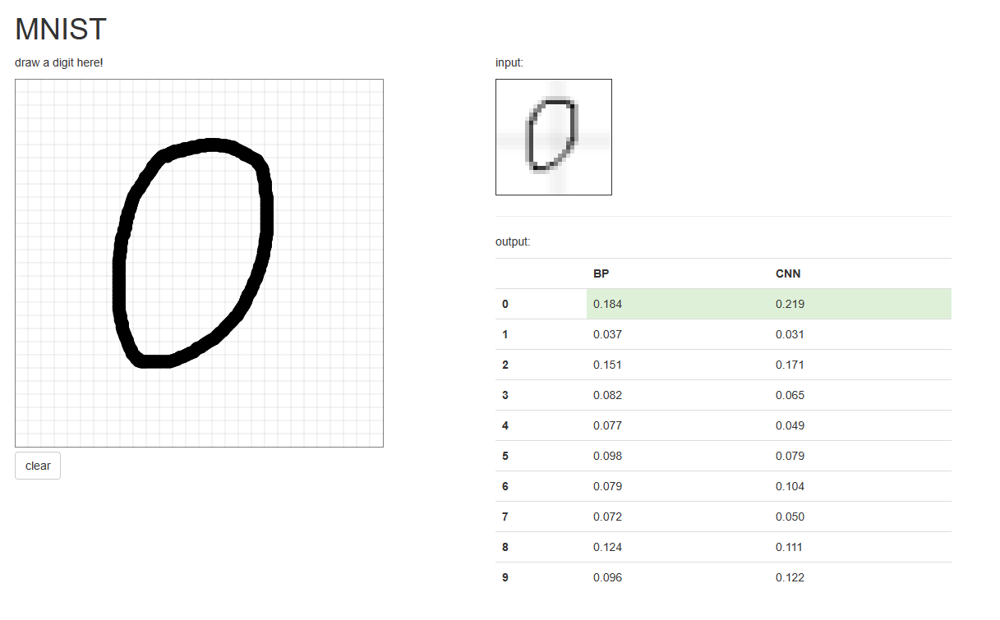
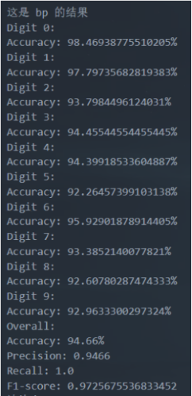
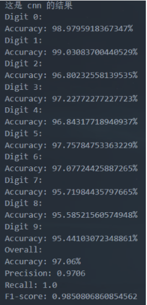

# 实验报告：基于 BP 算法的手写数字识

- [实验报告：基于 BP 算法的手写数字识](#实验报告基于-bp-算法的手写数字识)
- [1. 简介](#1-简介)
  - [1.1 项目简介](#11-项目简介)
  - [1.2 背景和意义](#12-背景和意义)
  - [1.3 目标和任务](#13-目标和任务)
- [2. 算法设计](#2-算法设计)
  - [2.1 BP 算法原理](#21-bp-算法原理)
  - [2.2 神经网络结构设计](#22-神经网络结构设计)
    - [2.2.1 输入层](#221-输入层)
    - [2.2.2 隐藏层](#222-隐藏层)
    - [2.2.3 输出层](#223-输出层)
  - [2.3 损失函数的选择](#23-损失函数的选择)
  - [2.4 梯度下降算法在 BP 算法中的应用](#24-梯度下降算法在-bp-算法中的应用)
  - [2.5 优化 BP 算法的方法](#25-优化-bp-算法的方法)
- [3. 碰到的问题与解决方法](#3-碰到的问题与解决方法)
  - [3.1 学习率选择问题](#31-学习率选择问题)
    - [3.1.1 问题描述：](#311-问题描述)
    - [3.1.2 解决方法：](#312-解决方法)
  - [3.2 过拟合问题处理](#32-过拟合问题处理)
    - [3.2.1 问题描述：](#321-问题描述)
    - [3.2.2 解决方法：](#322-解决方法)
- [4. 创新方法](#4-创新方法)
  - [4.1 卷积神经网络结构](#41-卷积神经网络结构)
  - [4.2 友好的图形界面设计](#42-友好的图形界面设计)
- [5. 结果分析](#5-结果分析)
  - [5.1 性能评估指标](#51-性能评估指标)
  - [5.2 实验结果分析](#52-实验结果分析)
- [6.讨论与思考](#6讨论与思考)
  - [6.1 算法的局限性讨论](#61-算法的局限性讨论)
  - [6.2 参数和模型结构对结果影响的思考](#62-参数和模型结构对结果影响的思考)
  - [6.3 一些可能的改进的方法](#63-一些可能的改进的方法)
- [小组成员： **刘兆宏** **沈尉林** **李小芊**](#小组成员-刘兆宏-沈尉林-李小芊)
- [小组分工：](#小组分工)
  - [代码：刘兆宏 沈尉林](#代码刘兆宏-沈尉林)
  - [实验报告： 刘兆宏 李小芊](#实验报告-刘兆宏-李小芊)

# 1. 简介

## 1.1 项目简介

手写数字识别是计算机视觉领域的一个重要任务，它涉及将手写数字图像分类为相应的数字类别。本项目旨在使用基于 BP 算法的神经网络来实现手写数字的识别。我们使用了经典的 MNIST 数据集作为训练和测试数据集，该数据集包含大量的手写数字图像样本，每个样本都标有相应的数字类别。

## 1.2 背景和意义

随着数字化时代的发展，手写数字的自动识别技术得到了广泛的关注和应用。手写数字识别可以应用于许多领域，包括自动邮件分拣、银行支票处理、手写数字输入等。通过自动识别手写数字，可以提高工作效率、减少人为错误，并且为人们提供更便捷的交互方式。因此，研究和实现基于 BP 算法的手写数字识别具有重要的现实意义。

## 1.3 目标和任务

本项目的主要目标是设计和实现一个基于 BP 算法的手写数字识别系统，并对该系统进行优化。具体任务包括：

- 理解 BP 算法的原理和基本思想。
- 设计和实现神经网络结构，包括输入层、隐藏层和输出层的节点数和连接方式。
- 选择合适的损失函数，并探索梯度下降算法在 BP 算法中的应用。
- 针对 BP 算法的局限性，提出优化方法以提高手写数字识别的准确性和鲁棒性。
- 引入卷积神经网络结构,与 BP 神经网络进行模型性能的对比和分析。
- 设计友好的图形界面，使用户能够方便地使用手写数字识别系统。
- 通过完成上述目标和任务，我们期望能够提高手写数字识别的准确率和实用性，并为进一步研究和应用提供参考。

接下来，我们将详细介绍 BP 算法的设计原理和实验过程。

# 2. 算法设计

## 2.1 BP 算法原理

BP 算法是一种常用的神经网络训练算法，用于通过反向传播误差信号来更新网络中的权值和偏置，以逐步优化网络的性能。BP 算法基于梯度下降法，通过最小化损失函数来调整网络参数，使其能够更好地拟合训练数据。

## 2.2 神经网络结构设计

    class BP(nn.Module):
    def __init__(self):
        super(BP, self).__init__()
        self.fc1 = nn.Linear(784, 128)
        self.fc2 = nn.Linear(128, 64)
        self.fc3 = nn.Linear(64, 10)

    def forward(self, x):
        x = x.view(x.size(0), -1)  # 将输入展平为一维向量
        x = torch.relu(self.fc1(x))
        x = torch.relu(self.fc2(x))
        x = self.fc3(x)
        return x

### 2.2.1 输入层

在手写数字识别任务中，输入层的节点数为 784，对应于输入图像的像素数。每个像素作为网络的一个输入节点。

### 2.2.2 隐藏层

为了增强网络的表达能力和分类准确性，我们设计了两个隐藏层。第一个隐藏层包含 128 个节点，第二个隐藏层包含 64 个节点。隐藏层的每个节点都与上一层的所有节点连接。

### 2.2.3 输出层

输出层是网络的最后一层，包含 10 个节点，对应于手写数字的 10 个类别（0 到 9）。每个节点表示一个数字类别的概率，网络将输出概率最高的类别作为预测结果。

## 2.3 损失函数的选择

在 BP 算法中，我们选择交叉熵损失函数作为目标函数。交叉熵损失函数能够度量预测结果与真实标签之间的差异，并将其最小化。对于多分类问题，交叉熵损失函数是一种常用且有效的选择。

## 2.4 梯度下降算法在 BP 算法中的应用

梯度下降算法是 BP 算法的核心步骤之一。在每次迭代中，我们计算网络输出与真实标签之间的误差，并通过链式法则计算各层的梯度。然后，使用梯度下降法更新网络中的权值和偏置，以降低损失函数的值。通过反复迭代和更新，网络逐渐收敛并达到较高的准确性。

## 2.5 优化 BP 算法的方法

尽管 BP 算法在手写数字识别中表现出良好的性能，但仍然存在一些问题，如容易陷入局部最优、训练速度慢等。为了解决这些问题并提高算法的性能，我们采用了以下创新方法：

- 学习率调整：在训练过程中，可以调整学习率的大小，以加速收敛或提高模型的准确性。
- 数据标准化：对输入数据进行标准化可以加速模型的训练和改善模型的性能。

      transform = transforms.Compose([transforms.ToTensor(), transforms.Normalize((0.1307,), (0.3081,))])

- 使用 SGD 算法：BP 算法中常用的优化算法是随机梯度下降（Stochastic Gradient Descent，SGD）。
  SGD 算法仅使用单个样本的梯度来更新参数，相比于使用整个训练集的梯度，计算效率更高。
  由于 SGD 每次更新参数时仅使用一个样本，参数的更新方向可能更具代表性，因此可以更快地收敛到较优的解。

      optimizer = optim.SGD(model.parameters(), lr=learning_rate)

# 3. 碰到的问题与解决方法

## 3.1 学习率选择问题

### 3.1.1 问题描述：

在训练过程中，选择合适的学习率是一个关键问题。学习率过小会导致收敛速度缓慢，而学习率过大可能导致模型无法收敛或者在最优点附近震荡。

### 3.1.2 解决方法：

为了选择合适的学习率，我们使用了以下方法：

初始学习率选择：可以从一个较小的学习率开始，例如 0.001，然后根据模型在训练集上的表现逐渐增大或减小学习率。观察损失函数的变化情况和模型的收敛速度，选择一个合适的学习率。

学习率衰减：可以在训练过程中逐渐减小学习率，例如每个 epoch 或者每隔一定步数减小学习率的大小。这样可以使模型在训练初期更快地接近最优解，而在接近最优解时减小学习率可以细致调整模型参数。

学习率预热：在训练初期，可以使用较小的学习率进行预热，使模型能够更好地适应数据分布，然后再逐渐增大学习率来加快收敛速度。

## 3.2 过拟合问题处理

### 3.2.1 问题描述：

过拟合是指模型在训练集上表现良好，但在测试集上的泛化能力较差。过拟合问题可能由于模型容量过大、训练数据不足、训练过程中的噪声等原因引起。

### 3.2.2 解决方法：

为了解决过拟合问题，我们使用了以下方法：

提前停止：在训练过程中监控模型在验证集上的性能，并选择在验证集上性能最好的模型参数进行保存。当模型在验证集上的性能不再提升时，可以提前停止训练，以避免过拟合。

# 4. 创新方法

## 4.1 卷积神经网络结构

在本项目中，引入了卷积神经网络（CNN）作为模型的主要结构。相比于传统的全连接神经网络，CNN 在图像处理任务中表现出色。它通过卷积层的堆叠，能够有效地提取图像的特征，并在全连接层进行分类。通过引入 CNN，我们可以充分利用图像中的局部信息和平移不变性，提高图像分类任务的性能。

    class CNN(nn.Module):
    def __init__(self):
        super(CNN, self).__init__()
        self.conv1 = nn.Conv2d(1, 10, kernel_size=5)
        self.conv2 = nn.Conv2d(10, 20, kernel_size=5)
        self.conv2_drop = nn.Dropout2d()
        self.fc1 = nn.Linear(320, 50)
        self.fc2 = nn.Linear(50, 10)

    def forward(self, x):
        x = F.relu(F.max_pool2d(self.conv1(x), 2))
        x = F.relu(F.max_pool2d(self.conv2_drop(self.conv2(x)), 2))
        x = x.view(-1, 320)
        x = F.relu(self.fc1(x))
        x = F.dropout(x, training=self.training)
        x = self.fc2(x)
        return F.log_softmax(x, dim=1)

## 4.2 友好的图形界面设计

为了提供更好的用户体验，我们设计了一个友好的图形界面。该界面允许用户直观地与系统交互，并提供以下功能：

- 图像绘制：用户可以通过界面绘制待分类的数字图像。
- 图像预处理：界面可以对上传的图像进行预处理，如尺寸调整、灰度转换等，以确保输入符合模型的要求。
- 模型预测：界面可以使用训练好的模型对预处理后的图像进行分类预测，并显示结果。
- 可视化结果：界面将显示预测结果，并以可视化方式呈现。
- 通过友好的图形界面设计，用户可以轻松绘制图像并获取模型的预测结果，无需编写代码或运行命令行脚本，提高了系统的可用性和易用性。

# 5. 结果分析

 

## 5.1 性能评估指标

在使用卷积神经网络（CNN）和反向传播（BP）算法进行数字分类的实验中，我们使用了几个性能评估指标来衡量模型的性能。

准确度（Accuracy）：准确度是最常用的评估指标之一，它表示模型正确预测的样本比例。在 CNN 模型中，整体准确度分别为 97.06%（CNN）和 94.66%（BP），说明两种模型在 MNIST 数字分类任务上都取得了不错的准确率。

我们将每个数字都看作一个类别，因此对于每个数字类别，我们计算了准确度。在 CNN 模型中，各个数字类别的精确度在 95%以上，表明模型在分类每个数字时都有较高的准确度。

精确度（Precision）：精确度表示模型在预测为正例的样本中，实际为正例的比例。CNN 模型的精确度在 95%以上，表明 CNN 模型在分类数字时都有较高的精确度。

召回率（Recall）：召回率表示模型在实际为正例的样本中，正确预测为正例的比例。在 MNIST 数字分类任务中，召回率为 1.0，这意味着模型能够正确地捕捉到每个数字类别的实例。

F1 分数（F1-score）：F1 分数是综合考虑精确度和召回率的评估指标，它同时考虑了模型的准确率和召回率。在 CNN 模型中，F1 分数为 0.985，说明模型在分类任务中具有较好的综合性能。

## 5.2 实验结果分析

根据实验结果，我们可以得出以下结论：

对于 CNN 模型，针对每个数字类别的分类准确度从 96.8%到 99.0%不等，整体准确度达到 97.06%。而 BP 神经网络模型的准确度从 92.3%到 98.5%不等，整体准确度为 94.66%。从这些结果可以看出，CNN 模型在识别手写数字方面具有更好的性能。

CNN 模型相对于 BP 模型在 MNIST 数字分类任务上表现更优。CNN 模型的整体准确度、精确度和 F1 分数均优于 BP 模型。这是因为 CNN 能够更好地利用图像的局部特征和平移不变性，从而提取更有信息量的特征进行分类。

在各个数字类别中，CNN 模型的准确度普遍高于 BP 模型。特别是在数字 0、1 和 2 的分类上，CNN 模型表现出更高的准确度。这可能是因为这些数字在形状和结构上有明显的特征，CNN 能够更好地捕捉到这些特征。

尽管 BP 模型的整体准确度较低，但它仍然能够正确分类大部分的数字。这说明即使简单的全连接神经网络也能够在一定程度上完成数字分类任务。

# 6.讨论与思考

## 6.1 算法的局限性讨论

在本实验中，虽然 CNN 模型取得了较好的分类性能，但仍存在一些局限性：

- 数据量和多样性：MNIST 数据集是一个相对简单的手写数字数据集，数字的形状和结构相对简单且规整。然而，在实际场景中，手写数字的多样性可能更加复杂，模型在处理更大规模和更多样化的数据时可能会面临挑战。

- 过拟合：在本实验中，模型没有采用过多的正则化技术来防止过拟合，因此在更复杂的数据集上，模型可能会出现过拟合的情况。

- 数据不平衡：MNIST 数据集中的各个数字类别的样本数是相对均衡的，但在实际应用中，数字类别之间可能存在明显的不平衡。对于不平衡数据集，模型可能倾向于预测样本数较多的类别，导致对于少数类别的分类效果较差。

## 6.2 参数和模型结构对结果影响的思考

在本实验中，参数和模型结构的选择对结果有一定影响。以下是一些思考：

- 卷积核大小和数量：卷积核的大小和数量可以影响模型对图像的特征提取能力。较小的卷积核可以捕捉更细节的特征，而较大的卷积核可以捕捉更全局的特征。增加卷积核的数量可以提高模型的复杂度和表达能力，但也会增加计算量和过拟合的风险。

- 学习率和优化器：学习率和优化器对模型的训练过程和结果都有重要影响。较小的学习率可以使模型更稳定地收敛，但训练时间可能会增加。较大的学习率可能导致训练不稳定和无法收敛。合适的学习率和选择合适的优化器如 SGD、Adam 等都是优化模型训练的关键。

## 6.3 一些可能的改进的方法

为了进一步改进模型的性能和功能，可以考虑以下方法：

- 数据增强：通过应用数据增强技术如旋转、平移、缩放等，可以扩充训练数据集，增加数据的多样性，提高模型的泛化能力。

- 更复杂的模型结构：尝试更深、更复杂的卷积神经网络结构，如 ResNet 等，以提高模型的表达能力和分类性能。

- 超参数调优：通过使用自动化的超参数调优方法，可以找到最优的超参数组合，提高模型性能。

- 更大的数据集：使用更大规模和多样化的数据集进行训练，以提高模型的泛化能力和对复杂场景的适应性。

  # 小组成员： **刘兆宏** **沈尉林** **李小芊**

  # 小组分工：

  ## 代码：刘兆宏 沈尉林

  ## 实验报告： 刘兆宏 李小芊
